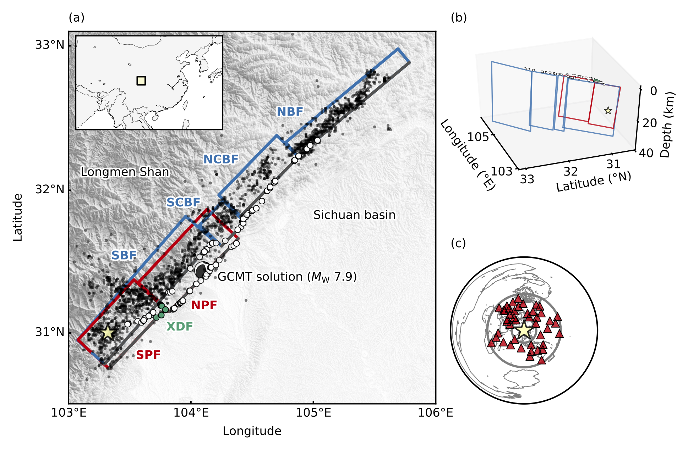
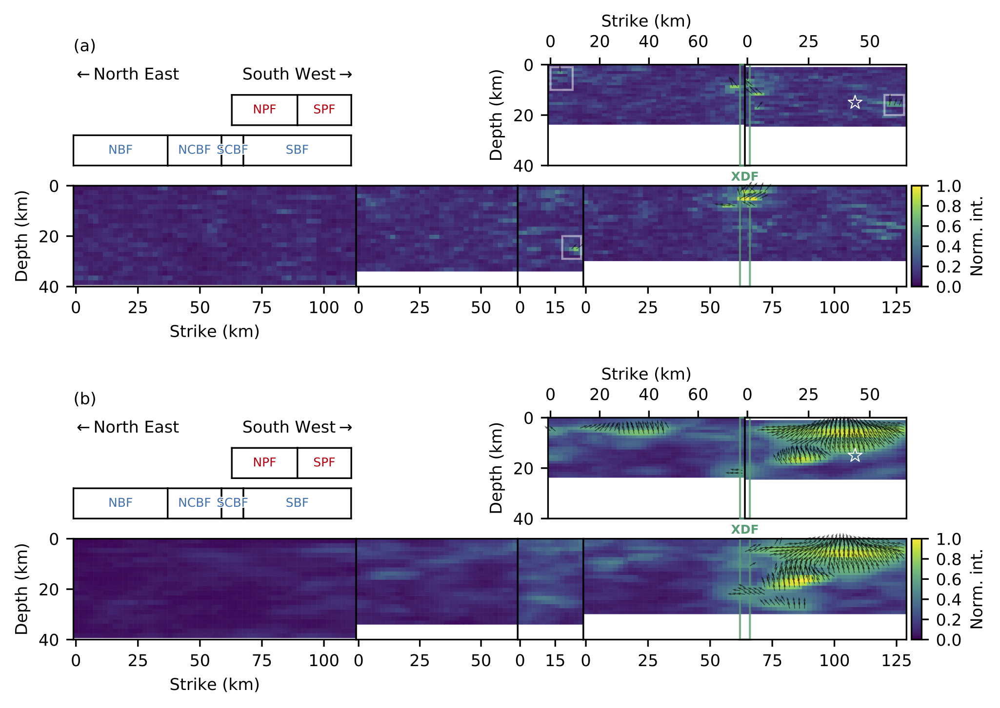
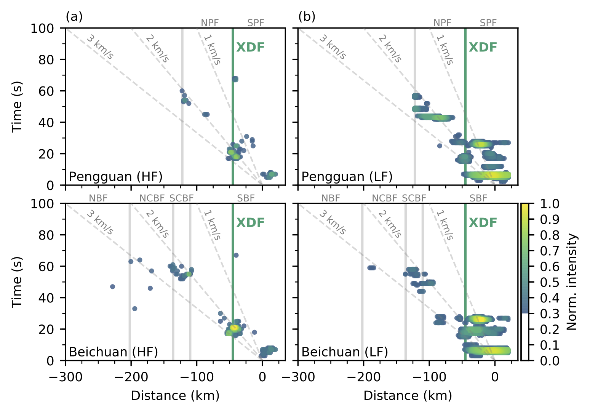
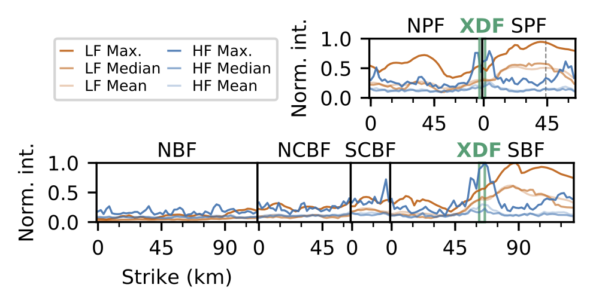

This archive follows the rule of [Oxford University Press' Author self-archiving policy](https://academic.oup.com/journals/pages/access_purchase/rights_and_permissions/self_archiving_policy_p).

# Role of geometric barriers in irregular-rupture evolution during the 2008 Wenchuan earthquake

[Ryo Okuwaki](https://rokuwaki.github.io) & [Yuji Yagi](http://www.geol.tsukuba.ac.jp/~yagi-y/eng/index.html)

- Corresponding author: Ryo Okuwaki ([rokuwaki@geol.tsukuba.ac.jp](mailto:rokuwaki@geol.tsukuba.ac.jp))

- Accepted 2017-11-16. Revision submitted 2017-10-16. Initial submission 2017-08-15.

# Abstract

Geometric discontinuities within fault systems known as geometric barriers contribute to irregular rupture evolutions during earthquakes. We applied a hybrid backprojection method to high-frequency teleseismic P -waveforms to investigate the role of geometric barriers in the rupture propagation during the Mw 7.9 2008 Wenchuan, China, earthquake. We found that sources of high-frequency waves were concentrated near the intersections of a northwest-trending cross-cutting fault with the dominant northeast-trending fault system and in areas around steps between fault segments of the dominant fault system. We recognized these areas as geometric barriers to rupture propagation. Our analysis of the high-frequency waves associated with the geometric discontinuities within the fault system showed that geometric barriers can decelerate or stop rupture propagation, but can also accelerate rupture when the rupture front crosses a geometric barrier and instigates rupture in an adjacent fault segment. Our result suggests that geometric discontinuities within fault systems can cause earthquake rupture propagation that is more complex than that of faults of simpler geometry associated with subduction zone megathrust earthquakes.

# Contents

- [Accepted article](./doc/revised-archive.pdf) (PDF:3.88 MB)

  This is a pre-copyedited, author-produced PDF of an article accepted for publication in *Geophysical Journal International* following peer review. The version of record "Role of geometric barriers in irregular-rupture evolution during the 2008 Wenchuan earthquake" by Ryo Okuwaki and Yuji Yagi is available online at: http://dx.doi.org/10.1093/gji/ggx502.

- [Supporting information](./doc/supp-archive.pdf) (PDF: 5.06 MB)

- [SAC files](./data/SACfiles)

- [Data for figures](./data)

- [Jupyter-notebook](./fig.ipynb)

- [Figures](./fig)

Fig. 1

Fig. 2

Fig. 3

Fig. 4

